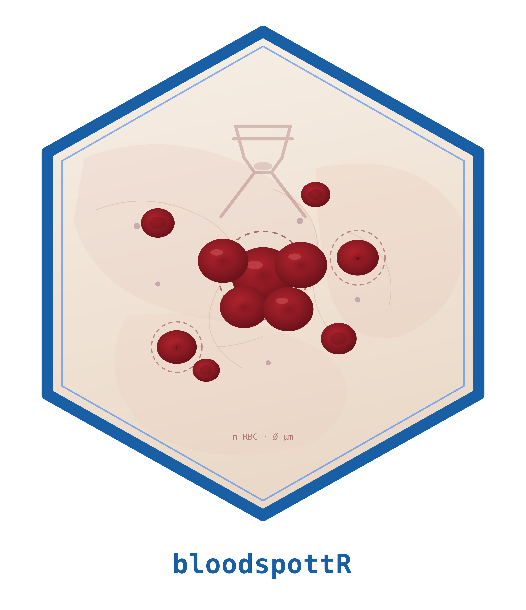
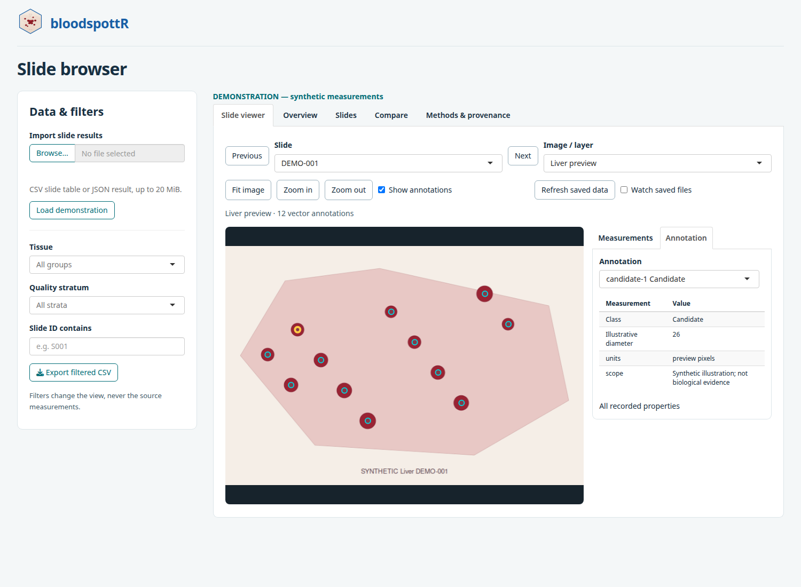

# bloodspottR 

**Calibrated histology measurements, traceable review and transparent reporting.**

bloodspottR brings red-positive tissue area and image-derived event candidates
into an explicit physical-slide workflow. It preserves measurement support,
missing values, quality decisions and provenance while keeping image readers,
annotation clients and model execution behind defined interfaces.

**Experimental software.** Numerical and software checks do not establish
biological accuracy. A candidate event is not necessarily one erythrocyte.
Native whole-slide inference, interactive QuPath review and portable DNN training
are not yet qualified end-to-end package features. The preserved study pipeline
and the reusable R package have separate validation histories.

## Installation

```r
install.packages("remotes")
remotes::install_github("CTTIR/bloodspottR", build_vignettes = TRUE)
install.packages("shiny")  # Optional results application
```

Required runtime dependencies are **digest** and **jsonlite**. Install
**openxlsx2** for workbook export. For the optional candidate-exchange adapter,
install **cellspecR** from `CTTIR/cellspecR`. No GPU software is needed to explore
existing results. The package is a development version and is not on CRAN.

## Start with an explicit demonstration

```r
library(bloodspottR)

results <- bs_example()  # Deterministic synthetic data, never study results
bs_validate(results)
results$groups <- bs_summarize(results, strata = c("organ", "stratum"))
results$groups

# Local read-only explorer; no inference service starts.
if (interactive()) bs_app(results)
```

The demonstration deliberately includes missing values and zero tissue support.
Pooled summaries propagate missing measurements. A zero numerator over known
positive tissue gives a measured zero; an unknown or zero denominator gives a
missing rate. Group rates divide sums, rather than averaging slide percentages.



## Import, summarize and preserve a delivery

```r
# Adapt a preserved study summary, or use profile = "canonical" for a canonical CSV.
# results <- bs_import_legacy("path/to/analysis.json")

results <- bs_example()
results$groups <- bs_summarize(results, strata = "organ")

# New destinations only: existing deliveries are never overwritten.
delivery <- tempfile("bloodspottr-report-")
report <- bs_report(
  results, delivery, author = "RH",
  background = "Synthetic demonstration of calibrated slide reporting."
)
report
list.files(delivery)
```

`bs_report()` writes self-contained HTML, CSV tables, canonical JSON and a
SHA-256 manifest. `bs_export_results()` writes the table bundle without HTML;
`xlsx = TRUE` adds a workbook when **openxlsx2** is installed. Large images,
individual annotation geometry and training weights remain separate artifacts.
The initial package renderer does not recreate the study-specific TeX/PDF image
supplement; its HTML can be printed from a browser.

## What is available

| Area | Implemented interface |
| --- | --- |
| Project metadata | `bs_project()`, `bs_status()` |
| Preserved measurements | `bs_import_legacy()`, `bs_validate()`, `bs_summarize()` |
| Paired comparison | `bs_compare()` with explicit shared-support checks |
| Review records | Saved-artifact review plans and confirmation receipts |
| Backend boundary | Versioned requests and explicit executable invocation |
| Suite reuse | `bs_cttir_inventory()`, calibrated `bs_as_cellspec()` exchange |
| Results | `bs_export_results()`, `bs_report()`, `bs_app()` |
| Existing measurement core | `measure_burden()`, `aggregate_burden()`, `measure_event_burden()`, `aggregate_event_burden()` |
| Color and profile shape | `bs_color_features()`, `bs_profile_extent()` |
| Optional spatial geometry | `tissue_window()`, `cell_pattern()` |

The package inventories source metadata across a chosen CTTIR suite directory
without loading or installing those packages. Runtime compatibility is tested
for the implemented cellspecR exchange; other adapters require qualification
within their respective scopes.

## Documentation

After installation with vignettes:

```r
vignette("bloodspottr-workflow", package = "bloodspottR")
vignette("cttir-interoperability", package = "bloodspottR")
vignette("review-and-backends", package = "bloodspottR")
```

The vignettes cover result exploration and delivery, calibrated event exchange,
and durable review receipts and trusted external-worker transactions. Function
help documents the implemented interfaces. Example data are synthetic.

## Validation and scope

The initial Linux candidate passed R CMD check without errors, warnings or notes,
with 454 passing assertions and 95.36% line coverage. Desktop and mobile Shiny
layouts were inspected. These checks establish software behavior, not biological
accuracy or cross-platform qualification.

The Shiny application explores results. Native whole-slide import and inference,
portable DNN training, live QuPath save/export transactions and generic slide
image PDF supplements remain separate implementation and qualification work.
Configured external workers are trusted code, not a security sandbox. Missing
measurements remain unknown, and low-signal slides are not inferred controls.

## License

MIT. Copyright 2026 R. Heller. See [LICENSE.md](LICENSE.md).
